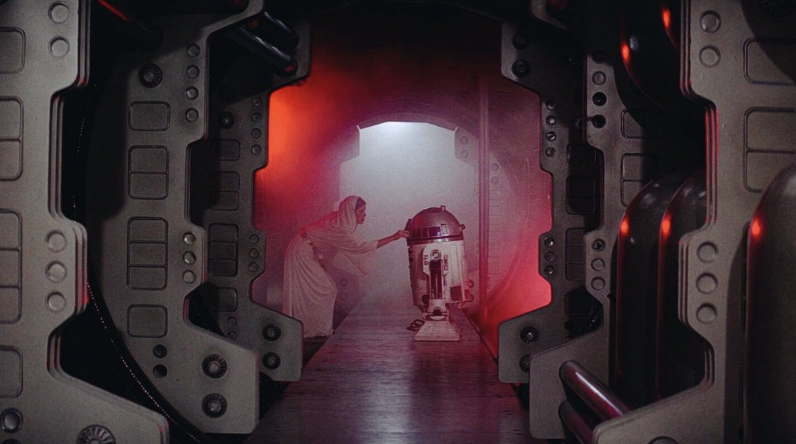
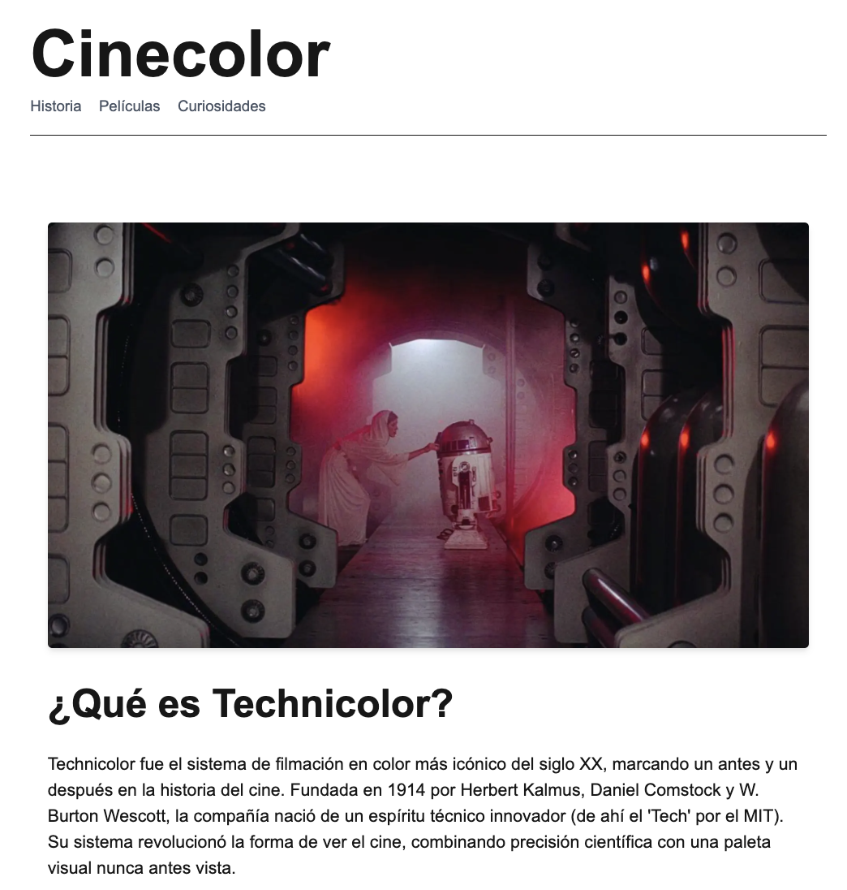
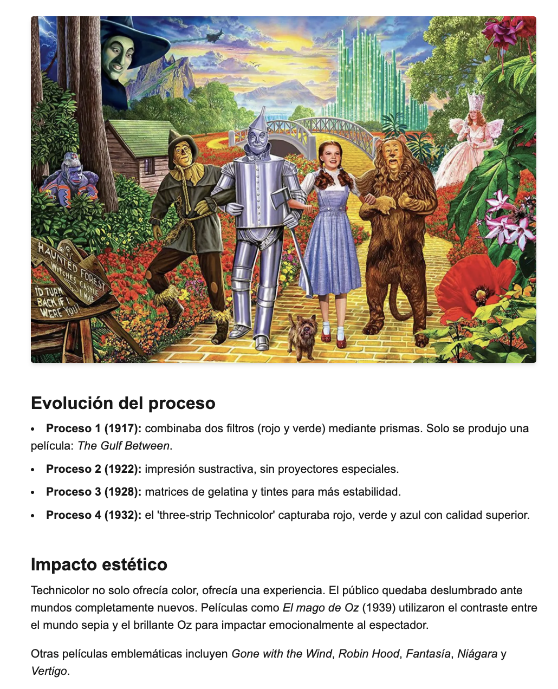
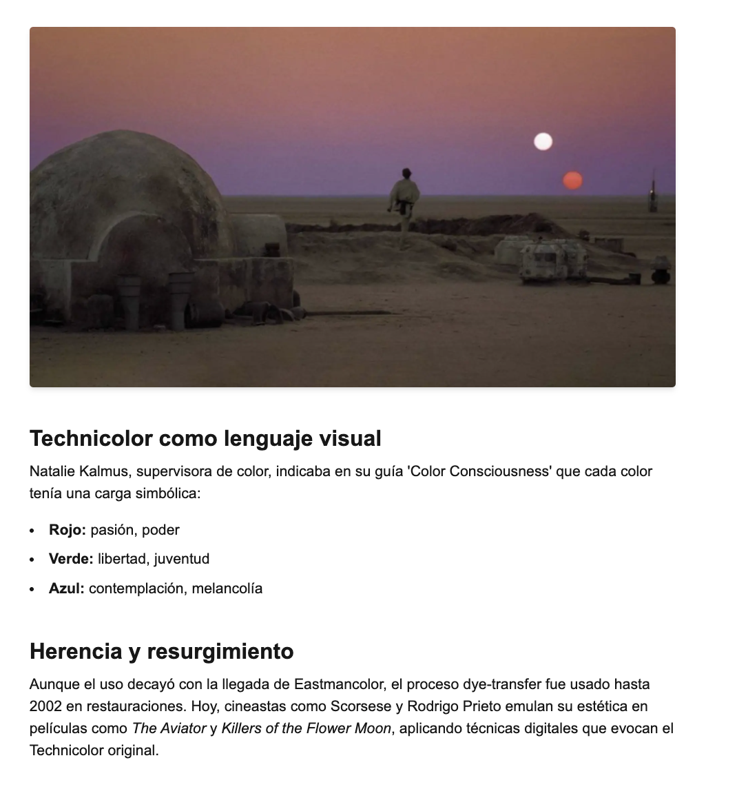
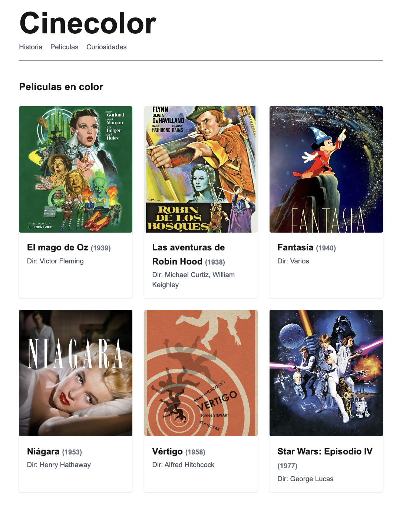

## Cinecolor – Blog sobre Technicolor y cine en color


Un blog informativo y visual sobre la historia, evolución e impacto del sistema de filmación en color Technicolor.
Este proyecto está hecho con **Next.js**, utiliza imágenes locales optimizadas con next/image

---

## 🌐 Deploy en Vercel: (https://cinecolor-blog-e4kf-git-main-spookycoincidences-projects.vercel.app/)

## ✨ Características
* Desarrollado con **Next.js** 
* Diseño responsive y minimalista
* Galería de imágenes con `next/image` optimizada
* Código limpio y fácil de modificar

---

## 🚀 Instalación y uso
1. Clonar el repositorio:
```bash
git clone git clone https://github.com/spookycoincidence/cinecolor-blog.git
```
2. Instalar dependencias:
```bash
cd cinecolor-blog
npm install
```
3. Correr la app en modo desarrollo:
```bash
npm run dev
```
4. Abrir http://localhost:3000 en el navegador


## 📸 Screenshots
---


  

---

  

---

  

---

  

---


## Tecnologías
* ⚛️ Next.js 
* 🧠 React 
* 💜 Tailwind CSS para estilos
* 📸 next/image para optimización de imágenes

## Desarrollado con ❤️ por spookycoincidence